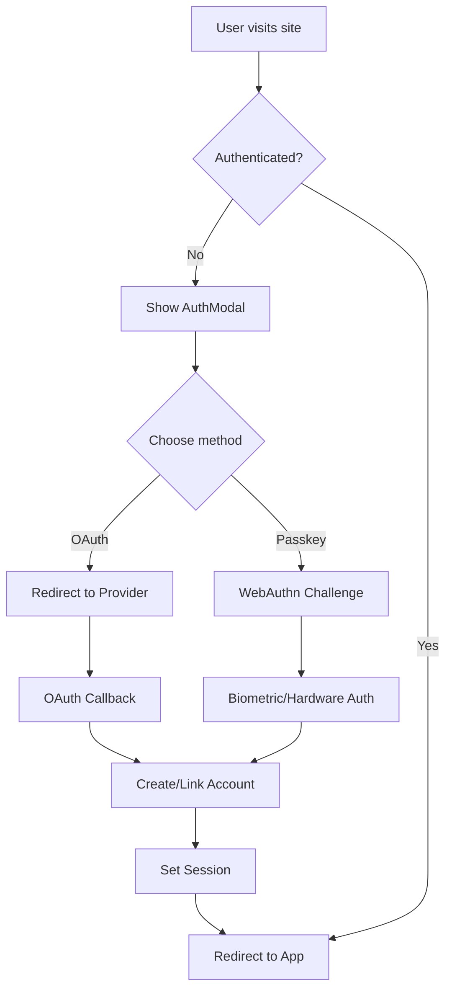

# Authentication Strategy - SSO + Passkeys Only

## Overview

CSFrace has implemented a modern, password-free authentication system using only **OAuth 2.0 Single Sign-On (SSO)** and **WebAuthn Passkeys**. This approach eliminates traditional username/password authentication in favor of more secure and user-friendly methods.

## Why SSO + Passkeys Only?

### Security Benefits
- **No password vulnerabilities**: Eliminates risks from weak passwords, password reuse, and credential breaches
- **Phishing resistance**: WebAuthn passkeys are cryptographically bound to the origin domain
- **Industry-standard OAuth 2.0**: Leverages proven, well-audited authentication protocols
- **Biometric security**: Supports fingerprint, face recognition, and hardware security keys
- **No password storage**: Backend never stores or handles user passwords

### User Experience Benefits  
- **Simplified registration**: No complex password requirements or confirmation fields
- **Faster sign-in**: One-click OAuth or biometric authentication
- **No forgotten passwords**: Eliminates password reset flows entirely
- **Cross-device compatibility**: Passkeys sync across devices via cloud providers
- **Familiar OAuth providers**: Users already trust Google, GitHub, Microsoft accounts

### Development Benefits
- **Reduced complexity**: No password validation, hashing, or reset functionality
- **Lower security maintenance**: OAuth providers handle security updates
- **Better scalability**: Offload authentication to specialized providers
- **Compliance advantages**: Reduced PII storage and handling requirements

## Implementation Architecture

### Authentication Components

#### 1. LoginForm.tsx
Modern login interface supporting:
- **Google OAuth 2.0**: Primary consumer authentication
- **GitHub OAuth 2.0**: Developer-focused authentication  
- **Microsoft OAuth 2.0**: Enterprise authentication
- **Facebook OAuth 2.0**: Social media authentication
- **Apple Sign-In**: iOS/macOS native authentication
- **WebAuthn Passkeys**: Biometric and hardware key authentication

```tsx
// Interface Segregation - focused authentication hooks
const { error: basicError, clearError } = useBasicAuth();
const { loginWithOAuth, isLoading: oauthLoading } = useOAuth();
const { authenticateWithPasskey, webauthnSupported } = useWebAuthn();
```

#### 2. RegisterForm.tsx
Streamlined registration supporting the same authentication methods:
- Account creation via OAuth providers (automatic)
- Passkey registration for new users
- No email/password collection required

#### 3. AuthModal.tsx
Unified modal supporting:
- Login and registration modes only
- Removed password reset functionality
- Keyboard navigation and accessibility

### Authentication Flow



## Technical Implementation

### OAuth 2.0 Integration

Each OAuth provider follows the standard flow:

1. **Authorization Request**: User clicks provider button
2. **Provider Redirect**: User authenticates with OAuth provider  
3. **Authorization Code**: Provider redirects back with code
4. **Token Exchange**: Backend exchanges code for access token
5. **Profile Retrieval**: Fetch user profile from provider API
6. **Account Creation/Link**: Create or link account in database
7. **Session Establishment**: Set authentication session/JWT

### WebAuthn/Passkeys Integration

Passkey authentication uses the W3C WebAuthn standard:

1. **Registration**: Create credential with `navigator.credentials.create()`
2. **Authentication**: Verify credential with `navigator.credentials.get()`
3. **Biometric/Hardware**: User provides biometric or hardware key
4. **Cryptographic Verification**: Backend verifies signature
5. **Session Establishment**: Set authentication session

### Backend Requirements

The backend must implement:

#### OAuth Endpoints
- `POST /auth/oauth/:provider/login` - Initiate OAuth flow
- `GET /auth/oauth/:provider/callback` - Handle OAuth callback
- `POST /auth/oauth/:provider/register` - Register via OAuth

#### WebAuthn Endpoints  
- `POST /auth/webauthn/register/begin` - Start passkey registration
- `POST /auth/webauthn/register/complete` - Complete passkey registration
- `POST /auth/webauthn/login/begin` - Start passkey authentication
- `POST /auth/webauthn/login/complete` - Complete passkey authentication

#### Session Management
- `POST /auth/logout` - Destroy session
- `GET /auth/me` - Get current user
- `POST /auth/refresh` - Refresh session/token

## Environment Configuration

### Frontend Environment Variables
```env
# OAuth Configuration
VITE_OAUTH_GOOGLE_CLIENT_ID=your_google_client_id
VITE_OAUTH_GITHUB_CLIENT_ID=your_github_client_id  
VITE_OAUTH_MICROSOFT_CLIENT_ID=your_microsoft_client_id
VITE_OAUTH_FACEBOOK_APP_ID=your_facebook_app_id
VITE_OAUTH_APPLE_CLIENT_ID=your_apple_service_id

# WebAuthn Configuration
VITE_WEBAUTHN_RP_NAME="CSFrace"
VITE_WEBAUTHN_RP_ID=localhost  # or your domain
VITE_WEBAUTHN_ORIGIN=http://localhost:3010  # or your URL

# API Configuration
VITE_API_URL=http://localhost:8000
VITE_API_TIMEOUT=30000
```

### Backend Environment Variables
```env
# OAuth Secrets (keep secure)
OAUTH_GOOGLE_CLIENT_SECRET=your_google_client_secret
OAUTH_GITHUB_CLIENT_SECRET=your_github_client_secret
OAUTH_MICROSOFT_CLIENT_SECRET=your_microsoft_client_secret
OAUTH_FACEBOOK_APP_SECRET=your_facebook_app_secret
OAUTH_APPLE_CLIENT_SECRET=your_apple_private_key_jwt

# JWT Configuration
JWT_SECRET=your_jwt_secret_key
JWT_EXPIRES_IN=7d

# WebAuthn Configuration  
WEBAUTHN_RP_NAME="CSFrace"
WEBAUTHN_RP_ID=localhost  # or your domain
WEBAUTHN_ORIGIN=http://localhost:3010  # or your URL
```

## Provider Setup

### Google OAuth 2.0 Setup
1. Go to [Google Cloud Console](https://console.cloud.google.com/)
2. Create project or select existing
3. Enable Google+ API
4. Create OAuth 2.0 credentials
5. Add authorized redirect URI: `{API_URL}/auth/oauth/google/callback`
6. Set authorized JavaScript origins: `{FRONTEND_URL}`

### GitHub OAuth Setup  
1. Go to GitHub Settings > Developer settings > OAuth Apps
2. Create new OAuth app
3. Set Authorization callback URL: `{API_URL}/auth/oauth/github/callback`
4. Set Homepage URL: `{FRONTEND_URL}`

### Microsoft OAuth Setup
1. Go to [Azure App Registrations](https://portal.azure.com/#blade/Microsoft_AAD_IAM/ActiveDirectoryMenuBlade/RegisteredApps)
2. Create new registration
3. Set redirect URI: `{API_URL}/auth/oauth/microsoft/callback`
4. Configure API permissions (User.Read minimum)

### Facebook OAuth Setup
1. Go to [Facebook for Developers](https://developers.facebook.com/)
2. Create new app or use existing
3. Add Facebook Login product
4. Set Valid OAuth Redirect URIs: `{API_URL}/auth/oauth/facebook/callback`
5. Configure app domains and privacy policy URL

### Apple Sign-In Setup
1. Go to [Apple Developer Portal](https://developer.apple.com/account/)
2. Create new Service ID under Certificates, Identifiers & Profiles
3. Configure Apple Sign-In capability
4. Set return URL: `{API_URL}/auth/oauth/apple/callback`
5. Configure domain and email verification

## Security Considerations

### HTTPS Requirements
- **Production**: HTTPS is mandatory for WebAuthn
- **OAuth**: All providers require HTTPS callbacks in production
- **Cookies**: Secure flag required for session cookies

### CORS Configuration
```typescript
// Backend CORS settings
const corsOptions = {
  origin: [
    'http://localhost:3010',  // Development
    'https://your-domain.com' // Production
  ],
  credentials: true, // Required for cookies
  methods: ['GET', 'POST', 'PUT', 'DELETE'],
  allowedHeaders: ['Content-Type', 'Authorization']
};
```

### Content Security Policy
```typescript
// CSP headers for OAuth and WebAuthn
{
  "Content-Security-Policy": [
    "connect-src 'self' accounts.google.com github.com login.microsoftonline.com",
    "frame-src accounts.google.com github.com login.microsoftonline.com",
    "script-src 'self' 'unsafe-inline'"  // Required for WebAuthn
  ].join('; ')
}
```

## Testing Strategy

### Unit Tests
- Authentication hook testing with mocked providers
- Component rendering with different authentication states
- OAuth flow state management
- WebAuthn credential creation/verification

### Integration Tests  
- End-to-end OAuth flows with test accounts
- WebAuthn registration and authentication
- Session management and logout
- Error handling and edge cases

### Manual Testing Checklist
- [ ] Google OAuth registration and login
- [ ] GitHub OAuth registration and login  
- [ ] Microsoft OAuth registration and login
- [ ] Passkey registration (if supported)
- [ ] Passkey authentication (if supported)
- [ ] Account linking for multiple providers
- [ ] Session persistence across browser restarts
- [ ] Logout functionality
- [ ] Error handling for failed authentications

## Migration Strategy

### For Existing Password Users
Since this is a new implementation, no migration is needed. However, if migrating from password-based authentication:

1. **Phase 1**: Add SSO + Passkeys alongside existing passwords
2. **Phase 2**: Encourage migration with UX incentives  
3. **Phase 3**: Deprecate password login after sufficient adoption
4. **Phase 4**: Remove password functionality entirely

### Data Migration
- Existing users link OAuth accounts to existing profiles
- Passkey credentials stored separately from user profiles
- No password data needs to be migrated (not stored)

## Monitoring and Analytics

### Authentication Metrics
- OAuth provider usage breakdown
- Passkey adoption rates  
- Authentication success/failure rates
- Session duration statistics
- Geographic authentication patterns

### Error Tracking
- OAuth provider failures
- WebAuthn compatibility issues
- Network timeout errors
- Invalid state/CSRF token errors

## Troubleshooting

### Common Issues

#### OAuth Redirect Mismatch
```
Error: redirect_uri_mismatch
```
**Solution**: Verify redirect URI in provider settings matches backend endpoint exactly

#### WebAuthn Not Supported  
```
Error: navigator.credentials is undefined
```
**Solution**: Ensure HTTPS in production, check browser compatibility

#### CORS Errors
```
Error: CORS policy blocked
```
**Solution**: Configure backend CORS to allow frontend origin with credentials

#### Invalid OAuth State
```
Error: Invalid state parameter
```
**Solution**: Ensure session persistence between OAuth initiation and callback

### Debug Mode
Enable debug logging:
```env
VITE_DEBUG_AUTH=true
LOG_LEVEL=debug
```

## Future Enhancements

### Planned Features
- **Apple Sign-In**: Add Apple OAuth provider
- **SAML Integration**: Enterprise SAML SSO support
- **Social Recovery**: Account recovery via social connections
- **Multi-Device Passkeys**: Cross-platform passkey synchronization

### Security Enhancements
- **Device Trust**: Remember trusted devices
- **Risk-Based Auth**: Additional verification for suspicious logins  
- **Session Management**: Active session monitoring and revocation
- **Audit Logging**: Comprehensive authentication audit trail

---

## Conclusion

The SSO + Passkeys-only authentication strategy provides:
- **Enhanced security** through modern protocols and biometrics
- **Improved user experience** with simplified, fast authentication
- **Reduced development complexity** by leveraging specialized providers
- **Better scalability** and maintenance characteristics

This approach aligns with modern security best practices and provides a foundation for secure, user-friendly authentication in the CSFrace application.